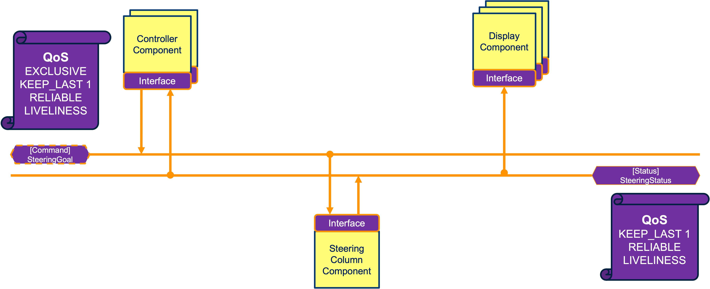

# Software Component : Steering Column Demo

## Introduction

Demonstrate Steering Column control using RTI Connext DDS.

The demo comprises of three applications exchanging data over the RTI Connext DDS, and shows how
to build a safe redundant fault tolerant real-time control system.
- a Steering Column (or *actuator*)
- one or more redundant Steering Controllers, and
- zero or more Steering Displays

The steering column can be commanded by one or more redundant controllers, and the status
is shown on the displays. Only one controller is primary, the rest are secondary. Failover is
automatic when the primary becomes inactive. When there are no active controllers, the steering column
automatically goes to a safe state.

## Dependencies

- [RTI Connext Professional](https://www.rti.com/products/connext-professional) 7.3 LTS (or newer)
  or [RTI Connext Drive](https://www.rti.com/products/connext-drive)
  - See [Connext Developers Getting Started Guide](https://community.rti.com/static/documentation/developers/)
    for installing RTI Connext

- [OPTIONAL] Python for Visualization
   - Install packages
     - Linux (Ubuntu)

           apt install python3-pip python3-pil python3-pil.imagetk

      - macOS

            brew install python@3.12 pillow python-tk@3.12

  - Create and activate venv

         python3.12 -m venv ~/.venv
         . ~/.venv/bin/activate

  - Install python libraries in the venv

         pip install pillow

         # rti.connext (see RTI Connext Getting Started)
         pip install rti.connext.activated -f $NDDSHOME/resource/python_api

## Getting Started

- Clone (or fork and clone) this repo, and make it the working directory, e.g.:

      git clone git@github.com:rticommunity/connextauto-swc-steering.git

      cd connextauto-swc-steering/

- Initialize, update, and checkout submodules

      make init

- Build for a target architecture `<arch>`

      make <arch>/build

  e.g.:
  | `<arch>`             | command
  | ---------------------|--------------------------------------
  | x64Linux4gcc7.3.0    | make x64Linux4gcc7.3.0/build
  | armv8Linux4gcc7.3.0  | make armv8Linux4gcc7.3.0/build
  | x64Darwin20clang12.0 | make x64Darwin20clang12.0/build

- Clean everthing and start fresh again:

      make clean init

- Run `make` or `make help` to see the list of available commands

      make [help]

## Run the applications

   The platform independent `makefile` provides a launcher to run the apps.
   The generic pattern for launching the apps is as follows.

      make <arch>/<app>

   Environment variables can passed as an additonal parameter on the make command to modify
   application behavior. For example, the following passes the environment variables
   STRENGTH and NDDS_DISCOVERY_PEERS to the application command.

      make <arch>/<app> STRENGTH=20 NDDS_DISCOVERY_PEERS=192.168.1.1

   Only the `controller` app pays attention to the STRENGTH enviornment variable.

  e.g.:
  | `<app>`    |`<arch>`              | command
  | -----------|----------------------|---------------------------------
  | actuator   | x64Linux4gcc7.3.0    | make x64Linux4gcc7.3.0/actuator
  |            | armv8Linux4gcc7.3.0  | make armv8Linux4gcc7.3.0/actuator
  |            | x64Darwin20clang12.0 | make x64Darwin20clang12.0/actuator
  | controller | x64Linux4gcc7.3.0    | make x64Linux4gcc7.3.0/controller STRENGTH=20
  |            | armv8Linux4gcc7.3.0  | make armv8Linux4gcc7.3.0/controller STRENGTH=20
  |            | x64Darwin20clang12.0 | make x64Darwin20clang12.0/controller STRENGTH=20
  |            | py (Python)          | make py/controller STRENGTH=20
  | display    | x64Linux4gcc7.3.0    | make x64Linux4gcc7.3.0/display
  |            | armv8Linux4gcc7.3.0  | make armv8Linux4gcc7.3.0/display
  |            | x64Darwin20clang12.0 | make x64Darwin20clang12.0/display
  |            | py (Python)          | make py/display

## Running on a remote target (e.g. Raspberry Pi)

- On Local Terminal: Package software component (apps and config files):

        make <arch>/swc

  e.g.:
  | `<arch>`             | command
  | ---------------------|--------------------------------------
  | x64Linux4gcc7.3.0    | make x64Linux4gcc7.3.0/swc
  | armv8Linux4gcc7.3.0  | make armv8Linux4gcc7.3.0/swc
  | x64Darwin20clang12.0 | make x64Darwin20clang12.0/swc

  This step creates a compressed tar package: `swc_<arch>.tgz`

- Transfer the package to the remote host, e.g.:

      scp swc_<arch>.tgz user@server:/remote/path/

- On Remote Terminal: Unpack the apps and config files

      cd /remote/path
      tar zxvf swc_<arch>.tgz

- On Remote Terminal, [run apps as before for the target architecture](#run-the-applications)

## Component Applications

The component applications are decribed below. The **SteeringColumn** application is implemented in C++. The
**SteeringController** and **SteeringDisplay** applications have two alternative implementation variants:
one in C++ with a textual user interface, and another in Python with a GUI.

- **SteeringColumn**, a.k.a. the steering actuator, takes steering commands and writes steering status.
  A C++ implementation for the [*SteeringColumn*](bus/if/steering/SteeringColumn.xml) data interface
  is provided.
  - [SteeringColumn.cxx](SteeringColumn.cxx): monitors discovered controllers, their
  liveliness, and also data delivery deadlines as per the QosPolicy settings:
    - when a controller becomes inactive (loses livelineses), automatically switches over
     the highest ownership strength active (alive) controller
    - when there are no active controllers, it steers to a safe state
    - prints the events as they happen and the curent count of active and matched controllers on stdout
- **SteeringController** writes steering commands. Two alternative implementations for
  the [*SteeringController*](bus/if/steering/SteeringController.xml) data interface are provided.
  - [SteeringController.cxx](SteeringController.cxx): command line interface
    - periodically outputs a steeering command angle, increasing clockwise
  - [SteeringController.py](SteeringController.py): GUI interface (requires Python)
    - user can set a steering command angle by moving a slider
- **SteeringDisplay** takes and displays steering status. Two alternative implementations for
  the [*SteeringDisplay*](bus/if/steering/SteeringDisplay.xml) data interface are provided.
  - [SteeringDisplay.cxx](SteeringDisplay.cxx): command line interface
    - prints the actual steeting wheel status on stdout
  - [SteeeringDisplay.py](SteeringDisplay.py): GUI interface (requires Python)
    - shows the actual steering wheel status in a simulated steering wheel GUI

The component applications can be launched anywhere (same host or multiple hosts)---as long as they
are reachable, they auto discover one another. Both Python and C++ components can be
simultaneously launched for a data interface. Any number of display components can be started
to observe the state of the actuator, from any reachable host.

Redundancy and failover is builtin to the controller and actuator components. When multiple controllers
are started, the one with the highest STRENGTH controls the actuator. If it loses connnectivity
(*not alive*), the control falls back to the next highest strength controller. If the actuator detects
that none of the controllers are alive, it reverts to a safe "neutral" state.

## How to Demo?

The component applications can be run in one or more host machines, virtual machines, or containers (e.g. docker).

### Demo Sequence

- Run **SteeringColumn** app
- Run **SteeringDisplay** apps (C++ and Python)
  - any number of these can be launched
- Run **SteeringController** apps (C++ and Python)
  - at least one C++ app and at least one Python app
  - vary the STRENGTH to establish the primary vs. secondary order
  - observe the **SteeringColumn** app printing out matching controllers as they are discovered
- Run **RTI Admin Console**
  - observe the data flows and the running applications
  - explore the data flows and the QosPolicies

Once the apps are running:

- Use the slider on the **SteeringController** python apps to set new steering commands
  - observe that the **SteeringColumn** only responds to the highest STRENGTH
    **SteeringController** (the primary one, as determined by STRENGTH)

- Suspend (Ctrl-Z) one or more of the **SteeringController** apps
  - observe the **SteeringColumn** app detect the liveliness change and fall back to next highest
    strength controller
  - observe the **SteeringDisplay** apps now show the result of the new controller commands

- Suspend all **SteeringController** apps, and observe the **SteeringColumn** steer to a safe state

- Terminate a **SteeringController** app
  - observe the **SteeringColumn** detect the change, and print the new count for matched controllers

- Terminate all **SteeringController** apps, and observe the **SteeringColumn** steer to a safe state

### Key Benefits

The key benefits of RTI Connext utilized by the demo include:

- Data-Oriented Architecture: applications interact only with the data
- LIVELINESS QosPolicy for detecting when controllers become inactive, and automatic
  failover between controllers
- OWNERSHIP and OWNERSHIP_STRENGTH QosPolicies for asserting exactly one primary controller, and
  achieving failover based on ownership strength
- RELIABLE QosPolicy with KEEP_LAST 1 HISTORY QosPolicy to act on the current command
- Automatic Discovery of applications across (no additional configuration required)
- Multiple host platforms
- Alternate implementations (C++, Python) of data interfaces described in DDS-XML

## Common Data Architecture

The data interfaces are defined in a separate *common data architecture* repository referenced via the
[bus](bus) submodule.

Browse the software system data architecture using [RTI System Designer](https://community.rti.com/static/documentation/connext-dds/current/doc/manuals/connext_dds_professional/tools/system_designer/index.html):

  -  Launch **RTI System Designer**
  - Open the [bus/connextauto_steering.rtisdproj](bus/connextauto_steering.rtisdproj) project
  - Browse the datatypes, qos profiles, data domains, and participant data interfaces

  | Artifact             | Files
  | ---------------------|--------------------------------------
  | Data Interfaces      | [bus/if/steering](bus/if/steering)
  | QoS Profiles         | [bus/res/qos](bus/res/qos)
  | Datatypes            | [bus/res/types/data/actuation/Steering_t.idl](bus/res/types/data/actuation/Steering_t.idl)

To make changes to the software system data architecture, clone and update the common data architecture
repo: [connextauto-bus](https://github.com/rticommunity/connextauto-bus).

---
(C) Copyright 2020-2025 Real-Time Innovations, Inc.  All rights reserved.

The use of this software is governed by the terms specified in the RTI Labs License Agreement, available at https://www.rti.com/terms/RTILabs. 

By accessing, downloading, or otherwise using this software, you agree to be bound by those terms.
